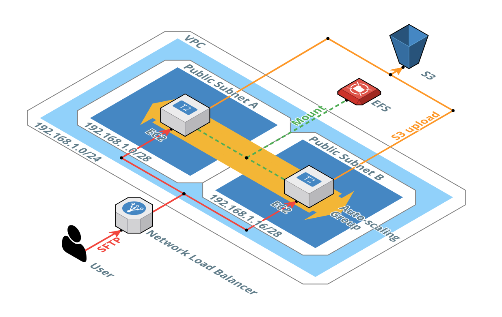

# SFTP Gateway High Availability Well-Architected

# CloudFormation Templates
* [SFTP Gateway (High Availability-Existing Network)](SFTP-Gateway-High-Availability-Existing-Network.yml)
This CloudFormation template automatically deploys a highly available infrastructure of SFTP Gateway, provisioning the necessary AWS resources into a VPC and two subnets of your choice. A Network Load Balancer routes traffic to instances deployed in an Autoscaling Group that spans two Availability Zones. An IAM role grants the EC2 instances permission to create S3 buckets and upload objects. EFS syncs local state between instances. And a Security Group restricts inbound access to certain network ranges over specific ports. After the CloudFormation stack spins up, you can connect to the Network Load Balancer hostname (found in the CloudFormation Outputs tab) from your web browser to create and manage SFTP users.
